# Crime a Montfleur - Jeu d'Aventure Textuel

## TABLE DES MATIERES

1. Introduction
2. Installation et Configuration
3. Description de l'Univers
4. Regles du Jeu
5. Commandes Disponibles
6. Carte du Jeu
7. Objets et Indices
8. Personnages NPJ
9. Quetes du Jeu
10. Architecture du Code
11. Ameliorations Futures
12. Demonstration
13. Credits

---

## INTRODUCTION

Crime a Montfleur est un jeu d'aventure textuel interactif en Python ou vous incarnez un enqueteur charge de resoudre un crime mysterieux. Une nuit sombre, un homicide a ete commis dans une maison de la rue principale de Montfleur. Les voisins murmurent, les temoins hesitent, et les preuves se cachent dans chaque recoin.

OBJECTIF PRINCIPAL

Votre mission est d'explorer les lieux, interroger les suspects, analyser les preuves au laboratoire et decouvrir le coupable (Durand) avant que le delai d'enquete ne s'ecoule.

PUBLIC CIBLE

- Amateurs de jeux textuels et aventures narratives
- Personnes interessees par la programmation orientee objet en Python
- Joueurs aimant les enigmes et les jeux de deduction

---

## INSTALLATION ET CONFIGURATION

PREREQUIS

- Python 3.7 ou superieur
- Terminal ou invite de commande
- Aucune dependance externe requise

ETAPES D'INSTALLATION

1. Cloner le repositor ou telecharger les fichiers:

   git clone https://github.com/DanielCourivaud/TBA.git
   cd TBA

2. Verifier les fichiers:

   ls -la

   Vous devriez voir:
   - game.py - Classe principale du jeu
   - room.py - Classes des salles
   - player.py - Classe du joueur
   - character.py - Classes des personnages
   - item.py - Classe des objets
   - command.py - Classe des commandes
   - actions.py - Actions disponibles
   - quest.py - Systeme de quetes
   - README.md - Ce fichier

3. Lancer le jeu:

   python game.py

4. Entrer votre nom et commencer l'enquete!

---

## DESCRIPTION DE L'UNIVERS

CADRE TEMPOREL ET SPATIAL

L'histoire se deroule dans la petite ville de Montfleur, une ville de province calme et ordinaire, sauf pour ce crime qui va bouleverser la vie de ses habitants. C'est une nuit sombre, l'ambiance est pesante, et chacun semble cacher un secret.

CONTEXTE DU CRIME

Un meurtre a ete commis a la Maison du crime sur la Rue de Montfleur. Les circonstances sont mysterieuses:

- Une blessure penetrante observee sur la victime
- Un couteau ensanglante trouve sur place
- Plusieurs suspects potentiels dans le voisinage
- Des preuves eparsees que vous devez decouvrir

AMBIANCE GENERALE

- Atmosphere de mystere et de suspicion
- Ville endormie cachant des secrets
- Enquete contre la montre pour resoudre le crime avant l'expiration du delai
- Dialogues revelatrices des personnages
- Progression graduelle vers la verite

---

## REGLES DU JEU

CONDITIONS DE VICTOIRE

Pour GAGNER, vous devez:

1. Analyser les 6 objets au Labo
   - couteau (Maison du crime)
   - cle (Maison de Durand)
   - lettre (Maison de Lenoir)
   - coffre (Cave)
   - photos (Grenier)
   - arme (Jardin)

2. Avoir tous les objets dans l'inventaire
   - Collectes depuis leurs emplacements originaux

3. Parler au Chimiste pour obtenir les resultats finaux
   - Commande: talk Chimiste (une fois tous les 6 objets analyses)
   - ETAPE OBLIGATOIRE avant l'accusation finale

4. Accuser Durand au Commissariat
   - Apres avoir parle au Chimiste pour les resultats
   - En parlant au Policier

5. Respecter le delai de 40 deplacements
   - Equivalent a 4 jours
   - Les salles gratuites (Grenier, Jardin, Cave, Labo) ne comptent pas

CONDITIONS DE DEFAITE

Vous PERDEZ si:

1. Accuser la mauvaise personne
   - Toute accusation autre que Durand = defaite immediate
   - Le jeu s'arrete et affiche "VOUS AVEZ PERDU"

2. Depasser 40 deplacements
   - Le temps d'enquete est epuise
   - Impossible de poursuivre

3. Ne pas analyser tous les 6 objets
   - Necessaire pour accuser et gagner
   - Chaque objet doit etre analyse au Labo

SYSTEME DE COMPTEUR

Deplacements comptes:
N, E, S, O, Rue, Maison_crime, Durand, Lenoir, Cafe, Commissariat, 
Parc, Bibliotheque, Morgue

Deplacements gratuits:
Grenier, Jardin, Cave, Labo

SYSTEME D'ANALYSE

- Maximum 6 analyses possibles (1 par objet)
- Chaque objet ne peut etre analyse qu'une seule fois
- L'analyse s'effectue au Labo du Commissariat
- Le Chimiste doit etre present pour analyser (commande analyze <objet>)
- L'objet doit etre dans votre inventaire
- ETAPE OBLIGATOIRE: Apres avoir analyse les 6 objets, parlez au Chimiste (talk Chimiste)
- Le Chimiste fournira les resultats finaux et confirmations
- Sans cette etape, vous ne pouvez pas progresser vers l'accusation finale

SYSTEME D'INDICES ET RECOMPENSES (NOUVEAU)

- Chaque QUETE completee donne un INDICE comme recompense
- Les indices aident a progresser dans l'enquete
- Exemples d'indices recus:
  * "Nouvelles pistes decouve rtes" - Quete 1: Inspecter la maison du crime
  * "Resultats d'analyse importants" - Quete 2: Faire analyser les objets
  * "Temoignages importants" - Quete 4: Explorer les environs
- Consultez les quetes avec: quests

SYSTEME D'EXAMEN D'OBJETS (NOUVEAU)

- Commande: examine <objet>
- Permet d'examiner un objet dans votre inventaire
- Revele des INDICES contextuels sur l'objet
- Exemples d'indices:
  * Lettre: "Durand cache quelque chose de grave. Cherche dans son coffre!"
  * Cle: "Elle provient de la maison de Durand..."
  * Couteau: "Les empreintes peuvent reveler le coupable."
  * Coffre: "Le contenu pourrait prouver la culpabilite."
- Utilisez examine pour obtenir des informations sans consommer le temps

SYSTEME D'INTERACTION D'OBJETS (NOUVEAU)

- Commande: use <objet1> on <objet2>
- Permet d'utiliser un objet sur un autre
- Declenche des actions et revele des secrets
- Exemple: use cle on coffre
  * Ouvre le coffre
  * Revele: "Des documents secrets de Durand prouvant sa culpabilite!"
  * Indice crucial: "Durand est bien le coupable!"
- Les interactions speciales ne comptent pas de deplacements

---

## COMMANDES DISPONIBLES

COMMANDES DE NAVIGATION

Commande: go
Syntaxe: go <direction>
Description: Se deplacer dans une direction
Exemple: go N (Nord), go E (Est), go S (Sud), go O (Ouest), go U (Up/Haut), go D (Down/Bas)

Commande: back
Syntaxe: back
Description: Revenir a la piece precedente
Exemple: back

Commande: history
Syntaxe: history
Description: Voir l'historique des salles visitees
Exemple: history

COMMANDES D'EXPLORATION

Commande: look
Syntaxe: look
Description: Observer l'environnement actuel
Exemple: look

Commande: check
Syntaxe: check
Description: Verifier votre inventaire
Exemple: check

Commande: take
Syntaxe: take <objet>
Description: Prendre un objet
Exemple: take couteau, take cle

Commande: drop
Syntaxe: drop <objet>
Description: Deposer un objet
Exemple: drop couteau

Commande: examine
Syntaxe: examine <objet>
Description: Examiner un objet pour obtenir des indices
Exemple: examine couteau, examine lettre
Note: Affiche des indices contextuels sur l'objet pour progresser dans l'enquete

COMMANDES D'INTERACTION

Commande: talk
Syntaxe: talk <nom>
Description: Parler a un personnage
Exemple: talk Durand, talk Medecin legiste

Commande: use
Syntaxe: use <objet1> on <objet2>
Description: Utiliser un objet sur un autre (interagir)
Exemple: use cle on coffre
Note: Declenche des actions speciales et revele des secrets

Commande: analyze
Syntaxe: analyze <objet>
Description: Analyser un objet (au Labo uniquement)
Exemple: analyze couteau, analyze cle
Note: L'objet doit etre dans votre inventaire
Note: Vous pouvez analyser les 6 objets UN PAR UN

Commande: accuse
Syntaxe: accuse <nom>
Description: Accuser quelqu'un (au Commissariat uniquement)
Exemple: accuse Durand

COMMANDES SYSTEME

Commande: help
Syntaxe: help
Description: Afficher la liste des commandes avec conseils detailles
Exemple: help

Commande: quests
Syntaxe: quests
Description: Voir les quetes, les recompenses et le temps restant
Exemple: quests
Note: Les quetes completees donnent des INDICES comme recompenses

Commande: quit
Syntaxe: quit
Description: Quitter le jeu
Exemple: quit

NOTES SUR LES COMMANDES

- Les directions: N (Nord), E (Est), S (Sud), O (Ouest), U (Up), D (Down)
- Les noms de personnages sont sensibles a la casse
- Vous pouvez combiner plusieurs mots pour les noms composes
- Les commandes ne sont pas sensibles a la casse
- NOUVEAU: Utilisez 'examine' pour obtenir des indices sur les objets
- NOUVEAU: Utilisez 'use' pour interagir avec les objets (ouvrir le coffre, etc.)
- NOUVEAU: Les quetes completees donnent des indices comme recompenses

---

## CARTE DU JEU

DIAGRAMME INTERACTIF (Mermaid)

```mermaid
graph TD
    Rue["Rue de Montfleur<br/>(HUB CENTRAL)"]
    Crime["Maison du crime<br/>(HUB SECONDAIRE)"]
    Durand["Maison de Durand"]
    Lenoir["Maison de Lenoir"]
    Cafe["Café du Marchand"]
    Commissariat["Commissariat<br/>(HUB ADMIN)"]
    Parc["Parc"]
    Bibli["Bibliothèque"]
    Grenier["Grenier"]
    Cave["Cave"]
    Jardin["Jardin"]
    Morgue["Morgue"]
    Labo["Labo du commissariat"]
    
    Rue -->|E| Crime
    Rue -->|N| Durand
    Rue -->|S| Lenoir
    Rue -->|O| Cafe
    
    Crime -->|U| Grenier
    Crime -->|D| Cave
    Crime -->|E| Jardin
    
    Durand -->|O| Morgue
    
    Lenoir -->|S| Parc
    
    Cafe -->|N| Commissariat
    
    Commissariat -->|E| Morgue
    Commissariat -->|O| Labo
    
    Parc -->|E| Bibli
```



VUE D'ENSEMBLE DES 13 SALLES


labo___Commissariat ___Morgue    Durand               Grenier
              |                    |                 //
             café___________Rue Montfleur ___ Maison_crime _____ Jardin
                                  |                 //
                                Lenoir            Cave
                                  |
                                 Parc ___ Bibliotheque


DETAIL DES CONNEXIONS

Salle: Rue de Montfleur (HUB CENTRAL)
Sorties Disponibles: E, N, S, O
- E (Est): Maison du crime
- N (Nord): Maison de Durand
- S (Sud): Maison de Lenoir
- O (Ouest): Cafe du Marchand

Salle: Maison du crime
Sorties Disponibles: O, U, D, E
- O (Ouest): Rue de Montfleur
- U (Haut): Grenier
- D (Bas): Cave
- E (Est): Jardin

Salle: Maison de Durand
Sorties Disponibles: S, O
- S (Sud): Rue de Montfleur
- O (Ouest): Cafe du Marchand

Salle: Maison de Lenoir
Sorties Disponibles: N, S
- N (Nord): Rue de Montfleur
- S (Sud): Parc de Montfleur

Salle: Cafe du Marchand
Sorties Disponibles: E, N
- E (Est): Rue de Montfleur
- N (Nord): Commissariat

Salle: Commissariat
Sorties Disponibles: S, E, O
- S (Sud): Cafe du Marchand
- E (Est): Morgue
- O (Ouest): Labo du commissariat

Salle: Parc de Montfleur
Sorties Disponibles: N, E
- N (Nord): Maison de Lenoir
- E (Est): Bibliotheque

Salle: Bibliotheque
Sorties Disponibles: O
- O (Ouest): Parc de Montfleur

Salle: Grenier
Sorties Disponibles: D
- D (Bas): Maison du crime

Salle: Cave
Sorties Disponibles: U
- U (Haut): Maison du crime

Salle: Jardin
Sorties Disponibles: O
- O (Ouest): Maison du crime

Salle: Morgue
Sorties Disponibles: O
- O (Ouest): Commissariat

Salle: Labo du commissariat
Sorties Disponibles: E
- E (Est): Commissariat

POINTS D'INTERET

Scene du Crime:
- Maison du crime (contient: couteau)

Maisons Suspectes:
- Maison de Durand (contient: cle)
- Maison de Lenoir (contient: lettre)

Zones Sombres:
- Grenier (contient: photos)
- Cave (contient: coffre)
- Jardin (contient: arme)

Institutions:
- Commissariat (Policier)
- Morgue (Medecin legiste)
- Labo (Chimiste)

Autres Lieux:
- Rue de Montfleur (centre-ville)
- Cafe du Marchand (rumeurs)
- Parc de Montfleur (temoins)
- Bibliotheque (archives)

---

## OBJETS ET INDICES

LES 6 OBJETS A ANALYSER

Objet 1: couteau - Un Couteau Ensanglante
Localisation: Maison du crime
Description: Un couteau ensanglante, clairement l'arme du crime
Indice: L'arme utilisee pour commettre le meurtre
Importance: Critique - premiere preuve

Objet 2: cle - Une Cle Suspecte
Localisation: Maison de Durand
Description: Une cle suspecte trouvee chez le suspect principal
Indice: Peut ouvrir le coffre a la Cave
Importance: Critique - lie Durand au crime

Objet 3: lettre - Une Lettre Mysterieuse
Localisation: Maison de Lenoir
Description: Une lettre contenant des informations compromettantes
Indice: Revele les motivations du crime
Importance: Haute - preuves circonstancielles

Objet 4: coffre - Un Coffre Verrouille
Localisation: Cave
Description: Un coffre verrouille contenant possiblement d'autres preuves
Indice: Peut etre ouvert avec la cle trouvee chez Durand
Importance: Haute - preuves directes

Objet 5: photos - Des Vieilles Photos
Localisation: Grenier
Description: Des vieilles photos trouvees au grenier
Indice: Peuvent contenir des preuves visuelles du crime
Importance: Moyenne - contexte historique

Objet 6: arme - Une Arme Dissimule
Localisation: Jardin
Description: Une arme dissimule dans les buissons
Indice: Preuve physique supplementaire
Importance: Critique - lien avec le criminel

OBJET BONUS (NON REQUIS)

Objet: livre_ville - Un Livre Decrivant l'Histoire de la Ville
Localisation: Bibliotheque
Description: Un livre inutile pour l'enquete
Utilite: Distraction, element de realisme

INDICES SUPPLEMENTAIRES

Les indices sont reveales par:
- Les dialogues des personnages
- L'autopsie du Medecin legiste
- L'analyse au Labo par le Chimiste
- L'observation des salles avec look

---

## PERSONNAGES (NPJ)

PERSONNAGE 1: Durand - Le Suspect Principal

Localisation: Maison de Durand (se deplace: Rue, Maison crime, Commissariat)
Description: Un voisin nerveux et louche
Role: Coupable principal du crime

Dialogues:
- "Je n'ai rien vu !"
- "Pourquoi me souconner ?"
- "Je vous ai deja dit la verite."

Indice: Nervosit suspecte, possession de la cle
Deplacements: Entre sa maison, la rue et le commissariat

PERSONNAGE 2: Lenoir - La Vieille Dame Mysterieuse

Localisation: Maison de Lenoir
Description: Une vieille dame qui a peut-etre vu quelque chose
Role: Temoin potentiel

Dialogues:
- "J'ai entendu un bruit..."
- "Je crois avoir vu une silhouette."
- "Tout cela est etrange..."

Indice: Temoin auditif et visuel
Deplacements: Reste generalement a sa maison

PERSONNAGE 3: Policier - L'Enqueteur du Commissariat

Localisation: Commissariat
Description: Un enqueteur experimente centralisant les preuves
Role: Autorite - c'est a lui que vous devez accuser

Dialogues:
- "Apportez-moi des preuves."
- "Vous devez analyser ces 6 objets: cle, photos, coffre, couteau, arme, lettre."
- "Les indices pointent vers Durand - accusez-le quand vous serez sur!"
- "La verite finira par eclater."

Indice: Confirme que l'accusation doit se faire au Commissariat
Deplacements: Reste au Commissariat

PERSONNAGE 4: Medecin legiste - L'Expert Medical

Localisation: Morgue
Description: Un medecin legiste studieux qui analyse la victime
Role: Fournit l'autopsie et les analyses circonstancielles

Dialogues:
- "Rapport preliminaire: sur la scene du crime j'ai observe une blessure penetrante..."
- "Autopsie: la cause du deces semble etre une plaie thoracique..."
- "ELEMENTS A ANALYSER (6 OBJETS): cle, photos, coffre, couteau, arme, lettre..."
- "Analyse circonstancielle: Durand s'est montre nerveux..."
- "COUPABLE PROBABLE: Durand!"
- "Conclusion et recommandations: la victime a ete attaquee sur place..."

Indice: Confirme les 6 objets a analyser et les conclusions
Deplacements: Reste a la Morgue

PERSONNAGE 5: Chimiste - Le Scientifique du Labo

Localisation: Labo du Commissariat
Description: Un chimiste competent du laboratoire de police
Role: Analyse les objets ET fournit les resultats finaux

Dialogues:
- "Bienvenue au laboratoire. Vous devez analyser 6 objets essentiels..."
- "J'ai tous les equipements necessaires pour tester ces preuves..."
- "Une fois tous les objets analyses, vous aurez suffisamment de preuves..."
- "Les resultats montrent que Durand est implique - allez l'accuser!"

ROLE CRUCIAL:
- Permet l'analyse des objets (commande analyze <objet>)
- IMPORTANT: Apres avoir analyse un objet, le Chimiste donne une confirmation
- Apres avoir analyse TOUS les 6 objets, vous DEVEZ parler au Chimiste (talk Chimiste)
- Le Chimiste fournira les resultats finaux et confirmera qui accuser
- Sans parler au Chimiste apres l'analyse, vous ne pourrez pas progresser efficacement

Indice: Crucial pour deux etapes:
  1. L'analyse des objets (utiliser analyze)
  2. L'obtention des resultats finaux (utiliser talk)

Deplacements: Reste au Labo
Commandes a utiliser:
- analyze <objet> - Pour analyser un objet (6 fois)
- talk Chimiste - OBLIGATOIRE apres les 6 analyses

---

## QUETES DU JEU

QUETES CHRONOLOGIQUES (DANS L'ORDRE DE PROGRESSION)

QUETE 1: Inspecter la maison du crime (PRIMAIRE)

Statut: Activee au demarrage
Objectif: Inspecter toutes les pieces de la maison du crime (Grenier, Maison, Cave, Jardin) 
          et recuperer les indices

Sous-taches:
1. Visiter le Grenier (trouve: photos)
2. Visiter le Sous-Sol (Cave) (trouve: coffre)
3. Visiter le Jardin (trouve: arme)
4. Recuperer les indices

Recompense: Nouvelles pistes decouertes
Delai: Idealement dans les premiers 15 deplacements
Condition de Completion: Visiter tous les lieux + collecter les 4 objets

QUETE 2: Faire analyser les objets au Labo (PRIMAIRE)

Objectif: Faire analyser les 6 objets trouves au Labo du Commissariat

Sous-taches:
1. Acceder au Labo du Commissariat
2. Parler au Chimiste (premiere fois)
3. Faire analyser chaque objet (6 fois)
   - Commande: analyze couteau
   - Commande: analyze cle
   - Commande: analyze lettre
   - Commande: analyze coffre
   - Commande: analyze photos
   - Commande: analyze arme
4. IMPORTANT: Parler au Chimiste APRES avoir analyse tous les objets
   - Commande: talk Chimiste
   - Le Chimiste confirmera l'analyse et donnera les resultats finaux

Recompense: Resultats d'analyse importants
Delai: Apres avoir collecte tous les objets
Condition de Completion: Analyser les 6 objets ET parler au Chimiste pour les resultats

QUETE 3: Aller a la morgue (PRIMAIRE)

Objectif: Aller a la morgue pour parler au Medecin legiste

Sous-taches:
1. Se rendre a la Morgue
2. Parler au Medecin legiste
3. Recuperer le rapport d'autopsie

Recompense: Indices sur la cause du deces
Delai: Avant l'accusation finale
Condition de Completion: Parler au Medecin legiste

QUETE 4: Explorer les environs (SECONDAIRE)

Objectif: Explorez les environs et cherchez des indices

Sous-taches:
1. Visiter le Parc
2. Visiter le Cafe
3. Interroger les temoins

Recompense: Temoignages importants
Delai: Entre les quetes 1 et 7
Condition de Completion: Visiter tous les lieux requis

QUETE 5: Inspecter chez Mme Lenoir (SECONDAIRE)

Objectif: Inspectez la maison de Mme Lenoir et interrogez-la

Sous-taches:
1. Visiter la maison de Lenoir
2. Fouiller la maison (prendre: lettre)
3. Parler a Mme Lenoir

Recompense: Decouvertes chez Lenoir
Delai: Avant la quete 6
Condition de Completion: Parler a Lenoir

QUETE 6: Analyser les objets chez Lenoir (SECONDAIRE)

Objectif: Faire analyser les objets trouves chez Lenoir

Sous-taches:
1. Apporter les objets au Commissariat
2. Faire analyser la lettre
3. Obtenir les resultats

Recompense: Preuves contre le meurtrier
Delai: Apres la quete 5
Condition de Completion: Analyser la lettre

QUETE 7: Inspecter chez Durand (SECONDAIRE)

Objectif: Inspectez chez Durand et trouvez-le pour l'interroger

Sous-taches:
1. Visiter la maison de Durand
2. Fouiller la maison (prendre: cle)
3. Trouver Durand (il se deplace)
4. L'interroger

Recompense: Aveux du meurtrier (potentiels)
Delai: Avant la quete 8
Condition de Completion: Parler a Durand

QUETE 8: Resoudre l'enigme (PRIMAIRE - FINALE)

Objectif: Reunir tous les indices et accuser le coupable

Sous-taches:
1. Reunir tous les indices
2. Analyser toutes les preuves
3. Accuser Durand au Commissariat

Recompense: Fin de l'enquete (VICTOIRE!)
Delai: Dans les 40 deplacements
Condition de Completion: Accuser Durand avec toutes les preuves

QUETES NON-CHRONOLOGIQUES (OPTIONNELLES)

QUETE 9: Ouvrir le coffre (OPTIONNELLE)

Objectif: Ouvrir le coffre avec la cle mysterieuse

Sous-taches:
1. Trouver la cle (Maison de Durand)
2. Recuperer le coffre (Cave)
3. Ouvrir le coffre

Recompense: Secrets du coffre
Remarque: Peut etre completee independemment

QUETE 10: Lire la lettre mysterieuse (OPTIONNELLE)

Objectif: Ouvrir et lire la lettre mysterieuse

Sous-taches:
1. Trouver la lettre (Maison de Lenoir)
2. Recuperer la lettre
3. Lire la lettre

Recompense: Revelations de la lettre
Remarque: Peut etre completee independemment

SYSTEME DE PROGRESSION DES QUETES

Quete 1 (Inspecter maison crime)
    |
    v
Quete 4 (Explorer les environs) + Quete 5 (Inspecter Lenoir)
    |
    v
Quete 6 (Analyser objets Lenoir) + Quete 7 (Inspecter Durand)
    |
    v
Quete 2 (Analyser objets au Labo)
    |
    v
Quete 3 (Aller a la morgue)
    |
    v
Quete 8 (RESOUDRE L'ENIGME - Accusation finale)
    |
    v
VICTOIRE!

---

## ARCHITECTURE DU CODE

MODULES PRINCIPAUX

MODULE: game.py - Classe Game (Principal)

Responsabilites: Gestion globale du jeu

Attributs:
- finished: bool - Si le jeu est termine
- rooms: list[Room] - Liste des salles
- commands: dict[str, Command] - Dictionnaire des commandes
- player: Player - Le joueur
- quest_manager: QuestManager - Gestionnaire des quetes
- displacement_count: int - Nombre de deplacements
- analyzed_items: set - Objets analyses
- required_items: set - Objets requis (6)
- accused: str - Personne accusee
- clues: list[str] - Liste des indices
- suspicions: dict - Suspicion par suspect

Fonctions cles:
- __init__() - Initialisation des variables de jeu
- setup() - Configuration des salles, objets, personnages, commandes
- play() - Boucle principale du jeu
- process_command() - Traitement des commandes du joueur
- win() - Verification de la victoire
- loose() - Verification de la defaite
- check_quest1_completion() - Verification des quetes
- update_characters() - Mise a jour des mouvements des NPJ
- print_welcome() - Affichage du message d'accueil

MODULE: room.py - Classe Room

Responsabilites: Representation des salles/lieux

Attributs:
- name: str - Nom de la salle
- description: str - Description detaillee
- inventory: dict[str, Item] - Dictionnaire des objets presents
- characters: dict[str, Character] - Dictionnaire des personnages presents
- exits: dict[str, Room] - Dictionnaire des sorties disponibles

Methodes cles:
- get_long_description() - Description complete
- get_exits() - Liste des sorties

MODULE: player.py - Classe Player

Responsabilites: Gestion du joueur

Attributs:
- name: str - Nom du joueur
- current_room: Room - Salle actuelle
- inventory: dict[str, Item] - Dictionnaire des objets du joueur
- history: list[Room] - Historique des salles visitees

Methodes cles:
- add_item(item: Item) - Ajouter un objet
- remove_item(name: str) - Enlever un objet

MODULE: character.py - Classe Character

Responsabilites: Gestion des NPJ

Attributs:
- name: str - Nom du personnage
- description: str - Description
- current_room: Room - Salle actuelle
- messages: list[str] - Liste des dialogues
- allowed_rooms: list[Room] - Salles ou se deplacer

Methodes cles:
- get_msg() - Obtenir un message
- move() - Se deplacer aleatoirement

MODULE: item.py - Classe Item

Responsabilites: Gestion des objets

Attributs:
- name: str - Nom de l'objet
- description: str - Description
- weight: float - Poids de l'objet

Methodes cles:
- get_full_description() - Description complete

MODULE: command.py - Classe Command

Responsabilites: Structure des commandes

Attributs:
- command_word: str - Mot-cle de la commande
- help_text: str - Texte d'aide
- action: function - Fonction a executer
- number_of_parameters: int - Nombre de parametres requis

MODULE: actions.py - Classe Actions

Responsabilites: Implementation de toutes les actions

Methodes principales (30+):
- help() - Afficher l'aide
- go() - Se deplacer
- back() - Revenir
- look() - Observer
- take() - Prendre un objet
- drop() - Deposer un objet
- check() - Verifier l'inventaire
- talk() - Parler a un personnage
- analyze() - Analyser un objet
- accuse() - Accuser quelqu'un
- quests() - Afficher les quetes
- history() - Afficher l'historique
- quit() - Quitter le jeu

MODULE: quest.py - Classes Quest et QuestManager

Classe Quest:
Attributs:
- title: str - Titre de la quete
- description: str - Description
- tasks: list[str] - Liste des sous-taches
- reward: str - Recompense
- is_completed: bool - Si la quete est completee

Methodes:
- activate() - Activer la quete
- complete_quest(player: Player) - Completer la quete
- get_status() - Obtenir le statut

Classe QuestManager:
Responsabilites: Gestion de l'ensemble des quetes

Methodes:
- add_quest(quest: Quest) - Ajouter une quete
- get_quest_by_title(title: str) - Obtenir une quete par titre
- complete_quest(quest: Quest) - Completer une quete

STRUCTURE DE DONNEES

Game
|- player (Player)
|  |- name
|  |- current_room (Room)
|  |- inventory (dict of Items)
|  |- history (list of Rooms)
|
|- rooms (list of Room)
|  |- Room
|     |- name
|     |- description
|     |- inventory (dict of Items)
|     |- characters (dict of Characters)
|     |- exits (dict of Rooms)
|
|- commands (dict of Commands)
|  |- Command
|     |- command_word
|     |- help_text
|     |- action (function)
|     |- number_of_parameters
|
|- quest_manager (QuestManager)
|  |- quests (list of Quests)
|     |- Quest
|        |- title
|        |- description
|        |- tasks
|        |- reward
|
|- clues (list of strings)
|- suspicions (dict of suspects)
|- analyzed_items (set of item names)

---

## AMELIORATIONS FUTURES

COURT TERME (v1.1-1.2)

- Ameliorer l'interface utilisateur avec des couleurs (colorama)
- Ajouter une animation textuelle au demarrage
- Implementation d'un systeme de sauvegarde/chargement
- Augmenter le nombre de dialogues des NPJ
- Ajouter des mini-jeux d'enigmes
- Systeme de musique/sons en ASCII art

MOYEN TERME (v2.0)

- Interface graphique simple (tkinter ou PyGame)
- Systeme de statistiques (temps ecoule, mouvements, etc.)
- Multiples scenarios/enquetes differentes
- Systeme de difficulte (Facile, Normal, Difficile)
- Mode multijoueur cooperatif
- Systeme de points de competence

LONG TERME (v3.0)

- Adaptation web (Django/Flask)
- Base de donnees pour les utilisateurs
- Competitions en ligne
- Creation de scenarios personnalises
- API REST pour integration
- Applications mobile (Android/iOS)

IDEES DE CONTENU SUPPLEMENTAIRE

- 5 autres enquetes differentes
- Systeme de competences d'enqueteur
- Objets rouges (fausses pistes)
- Multiples coupables possibles
- Amis/alliances avec les NPJ
- Consequences des accusations erronees
- Enigmes et casse-tete
- Systeme de reputation

---

## DEMONSTRATION

CAPTURES D'ECRAN TYPIQUES

ECRAN D'ACCUEIL

Bienvenue [Nom] dans Crime a Montfleur !
Entrez 'help' si vous avez besoin d'aide.

Une nuit sombre vient de tomber sur Montfleur...
Un crime mysterieux a ete commis dans une maison de la rue principale.
Les voisins murmurent, les temoins hesitent, et les preuves semblent se cacher dans chaque recoin.
Votre mission : explorer les lieux, interroger les habitants, et decouvrir la verite.

============================================================
CONDITIONS DE L'ENQUETE
============================================================
Temps disponible: 4 jours = 40 deplacements
(Les deplacements dans le Grenier, Jardin, Cave et Labo ne comptent pas)

Tapez 'quests' pour voir vos quetes et le temps restant
============================================================

Vous etes dans la Maison du crime.
Il y a des traces de lutte et une atmosphere pesante.
Sorties: O (Rue de Montfleur), U (Grenier), D (Cave), E (Jardin)
Objets presents: couteau

EXEMPLE DE PROGRESSION

> look
Vous etes dans la Maison du crime.
Il y a des traces de lutte et une atmosphere pesante.
Sorties: O, U, D, E
Objets presents: couteau

> take couteau
Vous avez pris l'objet 'couteau'.

> go U
Deplacement vers Grenier
Vous etes dans le Grenier.

> take photos
Vous avez pris l'objet 'photos'.

> check
Inventaire:
- couteau: un couteau ensanglante
- photos: des vieilles photos

> go O
Deplacement vers Rue de Montfleur

> go N
Deplacement vers Maison de Durand

> take cle
Vous avez pris l'objet 'cle'.

> talk Durand
Durand dit: "Je n'ai rien vu !"

VIDEO DE DEMONSTRATION RECOMMANDEE

Duree: 15-20 minutes
Contenu:
1. Lancer le jeu et explorer les salles (2 min)
2. Collecter les 6 objets (5 min)
3. Parler aux personnages (3 min)
4. Analyser au labo (3 min)
5. Accuser et gagner (2 min)
6. Montrer les conditions de defaite (1-2 min)

---

## CREDITS

AUTEUR(S) PRINCIPAL(AUX)

Daniel Courivaud - Concepteur et developpeur principal

INSPIRATIONS ET INFLUENCES

- Jeux textuels classiques (Zork, Adventure)
- Jeux d'enquete (Detective Conan)
- Jeux de mystere interactif

TECHNOLOGIES UTILISEES

- Python 3.7+ - Langage de programmation principal
- Programmation Orientee Objet (POO) - Paradigme de conception
- Structures de Donnees Python - Dictionnaires, listes, sets

RESSOURCES EDUCATIVES

- Documentation Python officielle
- Tutoriels POO en Python
- References sur la creation de jeux textuels

REMERCIEMENTS

- Communaute Python
- Testeurs et joueurs beta
- Tous qui a contribue a ameliorer le projet

LICENSE

- Libre d'utilisation pour fins educatives
- Code source disponible sur GitHub: https://github.com/DanielCourivaud/TBA

SUPPORT ET CONTACT

- Questions? Consultez le README.md
- Bugs? Ouvrez une issue sur GitHub
- Suggestions? Proposez une pull request

---

RESUME DU JEU

Crime a Montfleur est un jeu d'aventure textuel complet en Python, proposant:

- 13 salles interconnectees a explorer
- 5 personnages avec dialogues et deplacements
- 6 objets a analyser
- 10 quetes a accomplir
- Systeme de gestion du temps (40 deplacements)
- Conditions de victoire et defaite claires
- Interface en ligne de commande intuitive
- Code structure et oriente objet
- Replay value grace aux quetes optionnelles

TEMPS DE JEU ESTIME: 30-60 minutes par partie
DIFFICULTE: Moyenne
RECOMMANDE POUR: Amateurs de jeux textuels, debutants en Python, fans d'enigmes

LIENS UTILES

GitHub du Projet: https://github.com/DanielCourivaud/TBA
Python.org: https://www.python.org/
Documentation Python: https://docs.python.org/3/

Derniere mise a jour: Janvier 2026
Version: 1.0
Etat: Production

---

## 🎬 Introduction

**Crime à Montfleur** est un jeu d'aventure textuel interactif en Python où vous incarnez un enquêteur chargé de résoudre un crime mystérieux. Une nuit sombre, un homicide a été commis dans une maison de la rue principale de Montfleur. Les voisins murmurent, les témoins hésitent, et les preuves se cachent dans chaque recoin.

### Objectif Principal
Votre mission est d'explorer les lieux, interroger les suspects, analyser les preuves au laboratoire et découvrir le coupable (**Durand**) avant que le délai d'enquête ne s'écoule.

### Public Cible
- Amateurs de jeux textuels et aventures narratives
- Personnes intéressées par la programmation orientée objet en Python
- Joueurs aimant les énigmes et les jeux de déduction

---

## 💻 Installation

### Prérequis
- Python 3.7 ou supérieur
- Terminal ou invite de commande
- Aucune dépendance externe requise

### Étapes d'Installation

1. **Cloner le repositor ou télécharger les fichiers:**
```bash
git clone https://github.com/DanielCourivaud/TBA.git
cd TBA
```

2. **Vérifier les fichiers:**
```bash
ls -la
```

Vous devriez voir:
- `game.py` - Classe principale du jeu
- `room.py` - Classes des salles
- `player.py` - Classe du joueur
- `character.py` - Classes des personnages
- `item.py` - Classe des objets
- `command.py` - Classe des commandes
- `actions.py` - Actions disponibles
- `quest.py` - Système de quêtes
- `README.md` - Ce fichier

3. **Lancer le jeu:**
```bash
python game.py
```

4. **Entrer votre nom et commencer l'enquête!**

---

## 🌍 Description de l'Univers

### Cadre Temporel et Spatial
L'histoire se déroule dans la petite ville de **Montfleur**, une ville de province calme et ordinaire, sauf pour ce crime qui va bouleverser la vie de ses habitants. C'est une nuit sombre, l'ambiance est pesante, et chacun semble cacher un secret.

### Contexte du Crime
Un meurtre a été commis à la **Maison du crime** sur la **Rue de Montfleur**. Les circonstances sont mystérieuses:
- Une **blessure pénétrante** observée sur la victime
- Un **couteau ensanglanté** trouvé sur place
- Plusieurs **suspects potentiels** dans le voisinage
- Des **preuves éparses** que vous devez découvrir

### Ambiance Générale
- Atmosphère de mystère et de suspicion
- Ville endormie cachant des secrets
- Enquête contre la montre pour résoudre le crime avant l'expiration du délai
- Dialogues révélateurs des personnages
- Progression graduelle vers la vérité

---

## 🎮 Règles du Jeu

### Conditions de Victoire ✅

Pour **GAGNER**, vous devez:

1. **✓ Analyser les 6 objets au Labo**
   - couteau (Maison du crime)
   - clé (Maison de Durand)
   - lettre (Maison de Lenoir)
   - coffre (Cave)
   - photos (Grenier)
   - arme (Jardin)

2. **✓ Avoir tous les objets dans l'inventaire**
   - Collectés depuis leurs emplacements originaux

3. **✓ Accuser Durand au Commissariat**
   - Après avoir analysé tous les objets
   - En parlant au Policier

4. **✓ Respecter le délai de 40 déplacements**
   - Équivalent à 4 jours
   - Les salles gratuites (Grenier, Jardin, Cave, Labo) ne comptent pas

### Conditions de Défaite ❌

Vous **PERDEZ** si:

1. **✗ Accuser la mauvaise personne**
   - Toute accusation autre que Durand = défaite immédiate
   - Le jeu s'arrête et affiche "VOUS AVEZ PERDU"

2. **✗ Dépasser 40 déplacements**
   - Le temps d'enquête est épuisé
   - Impossible de poursuivre

3. **✗ Ne pas analyser tous les 6 objets**
   - Nécessaire pour accuser et gagner
   - Chaque objet doit être analysé au Labo

### Système de Compteur

```
Déplacements comptés: N, E, S, O, Rue, Maison_crime, Durand, Lenoir, 
                      Café, Commissariat, Parc, Bibliothèque, Morgue
Déplacements gratuits: Grenier, Jardin, Cave, Labo
```

### Système d'Analyse

- **Maximum 6 analyses** possibles (1 par objet)
- Chaque objet ne peut être analysé qu'**une seule fois**
- L'analyse s'effectue au **Labo du commissariat**
- Le **Chimiste** doit être présent pour analyser
- L'objet doit être dans votre **inventaire**

---

## 🕹️ Commandes

### Commandes de Navigation

| Commande | Syntaxe | Description | Exemple |
|----------|---------|-------------|---------|
| `go` | `go <direction>` | Se déplacer dans une direction | `go N` (Nord), `go E` (Est), `go S` (Sud), `go O` (Ouest), `go U` (Up/Haut), `go D` (Down/Bas) |
| `back` | `back` | Revenir à la pièce précédente | `back` |
| `history` | `history` | Voir l'historique des salles visitées | `history` |

### Commandes d'Exploration

| Commande | Syntaxe | Description | Exemple |
|----------|---------|-------------|---------|
| `look` | `look` | Observer l'environnement actuel | `look` |
| `check` | `check` | Vérifier votre inventaire | `check` |
| `take` | `take <objet>` | Prendre un objet | `take couteau`, `take clé` |
| `drop` | `drop <objet>` | Déposer un objet | `drop couteau` |

### Commandes d'Interaction

| Commande | Syntaxe | Description | Exemple |
|----------|---------|-------------|---------|
| `talk` | `talk <nom>` | Parler à un personnage | `talk Durand`, `talk Médecin légiste` |
| `analyze` | `analyze <objet>` | Analyser un objet (au Labo uniquement) | `analyze couteau`, `analyze clé` |
| `accuse` | `accuse <nom>` | Accuser quelqu'un (au Commissariat uniquement) | `accuse Durand` |

### Commandes Système

| Commande | Syntaxe | Description | Exemple |
|----------|---------|-------------|---------|
| `help` | `help` | Afficher la liste des commandes | `help` |
| `quests` | `quests` | Voir les quêtes et le temps restant | `quests` |
| `quit` | `quit` | Quitter le jeu | `quit` |

### Notes sur les Commandes
- Les directions: **N**ord, **E**st, **S**ud, **O**uest, **U**p (Haut), **D**own (Bas)
- Les noms de personnages sont **sensibles à la casse**
- Vous pouvez combiner plusieurs mots pour les noms composés
- Les commandes ne sont **pas sensibles à la casse**

---

## 🗺️ Carte du Jeu

### Vue d'Ensemble des 13 Salles

```
                          Parc
                           |
    Durand --- Rue --- Maison_crime --- Jardin
      |       Montfleur     |
    Café  --- Commissariat  Grenier
      |          |  \        |
      |        Morgue  Labo  Cave
      |          |
   Bibliothèque---
```

### Détail des Connexions

| Salle | Sorties | Connexions |
|-------|---------|-----------|
| **Rue de Montfleur** | E, N, S, O | Maison du crime (E), Durand (N), Lenoir (S), Café (O) |
| **Maison du crime** | O, U, D, E | Rue Montfleur (O), Grenier (U), Cave (D), Jardin (E) |
| **Maison de Durand** | S, O | Rue Montfleur (S), Café (O) |
| **Maison de Lenoir** | N, S | Rue Montfleur (N), Parc (S) |
| **Café du Marchand** | E, N | Rue Montfleur (E), Commissariat (N) |
| **Commissariat** | S, E, O | Café (S), Morgue (E), Labo (O) |
| **Parc de Montfleur** | N, E | Lenoir (N), Bibliothèque (E) |
| **Bibliothèque** | O | Parc (O) |
| **Grenier** | D | Maison du crime (D) |
| **Cave** | U | Maison du crime (U) |
| **Jardin** | O | Maison du crime (O) |
| **Morgue** | O | Commissariat (O) |
| **Labo** | E | Commissariat (E) |

### Points d'Intérêt

**🔴 Scène du Crime:**
- Maison du crime (contient: couteau)

**🟡 Maisons Suspectes:**
- Maison de Durand (contient: clé)
- Maison de Lenoir (contient: lettre)

**🟢 Zones Sombres:**
- Grenier (contient: photos)
- Cave (contient: coffre)
- Jardin (contient: arme)

**🔵 Institutions:**
- Commissariat (Policier)
- Morgue (Médecin légiste)
- Labo (Chimiste)

**⚪ Autres Lieux:**
- Rue de Montfleur (centre-ville)
- Café du Marchand (rumeurs)
- Parc de Montfleur (témoins)
- Bibliothèque (archives)

---

## 🔎 Objets et Indices

### Les 6 Objets à Analyser

#### 1. **couteau** - Un Couteau Ensanglanté
- **Localisation:** Maison du crime
- **Description:** Un couteau ensanglanté, clairement l'arme du crime
- **Indice:** L'arme utilisée pour commettre le meurtre
- **Importance:** Critique - première preuve

#### 2. **clé** - Une Clé Suspecte
- **Localisation:** Maison de Durand
- **Description:** Une clé suspecte trouvée chez le suspect principal
- **Indice:** Peut ouvrir le coffre à la Cave
- **Importance:** Critique - lie Durand au crime

#### 3. **lettre** - Une Lettre Mystérieuse
- **Localisation:** Maison de Lenoir
- **Description:** Une lettre contenant des informations compromettantes
- **Indice:** Révèle les motivations du crime
- **Importance:** Haute - preuves circonstancielles

#### 4. **coffre** - Un Coffre Verrouillé
- **Localisation:** Cave
- **Description:** Un coffre verrouillé contenant possiblement d'autres preuves
- **Indice:** Peut être ouvert avec la clé trouvée chez Durand
- **Importance:** Haute - preuves directes

#### 5. **photos** - Des Vieilles Photos
- **Localisation:** Grenier
- **Description:** Des vieilles photos trouvées au grenier
- **Indice:** Peuvent contenir des preuves visuelles du crime
- **Importance:** Moyenne - contexte historique

#### 6. **arme** - Une Arme Dissimulée
- **Localisation:** Jardin
- **Description:** Une arme dissimulée dans les buissons
- **Indice:** Preuve physique supplémentaire
- **Importance:** Critique - lien avec le criminel

### Objet Bonus (Non Requis)

#### **livre_ville** - Un Livre Décrivant l'Histoire de la Ville
- **Localisation:** Bibliothèque
- **Description:** Un livre inutile pour l'enquête
- **Utilité:** Distraction, élément de réalisme

### Indices Supplémentaires

Les indices sont révélés par:
- Les **dialogues des personnages**
- L'**autopsie** du Médecin légiste
- L'**analyse** au Labo par le Chimiste
- L'**observation** des salles avec `look`

### Indice Clé du Chimiste
*"Bienvenue au laboratoire. Vous devez analyser 6 objets essentiels..."*

---

## 👥 Personnages (PNJ)

### 1. **Durand** - Le Suspect Principal
- **Localisation:** Maison de Durand (se déplace: Rue, Maison crime, Commissariat)
- **Description:** Un voisin nerveux et louche
- **Rôle:** Coupable principal du crime
- **Dialogues:**
  - "Je n'ai rien vu !"
  - "Pourquoi me soupçonner ?"
  - "Je vous ai déjà dit la vérité."
- **Indice:** Nervosité suspecte, possession de la clé
- **Déplacements:** Entre sa maison, la rue et le commissariat

### 2. **Lenoir** - La Vieille Dame Mystérieuse
- **Localisation:** Maison de Lenoir
- **Description:** Une vieille dame qui a peut-être vu quelque chose
- **Rôle:** Témoin potentiel
- **Dialogues:**
  - "J'ai entendu un bruit..."
  - "Je crois avoir vu une silhouette."
  - "Tout cela est étrange..."
- **Indice:** Témoin auditif et visuel
- **Déplacements:** Reste généralement à sa maison

### 3. **Policier** - L'Enquêteur du Commissariat
- **Localisation:** Commissariat
- **Description:** Un enquêteur expérimenté centralisant les preuves
- **Rôle:** Autorité - c'est à lui que vous devez accuser
- **Dialogues:**
  - "Apportez-moi des preuves."
  - "Vous devez analyser ces 6 objets: clé, photos, coffre, couteau, arme, lettre."
  - "Les indices pointent vers Durand - accusez-le quand vous serez sûr!"
  - "La vérité finira par éclater."
- **Indice:** Confirme que l'accusation doit se faire au Commissariat
- **Déplacements:** Reste au Commissariat

### 4. **Médecin légiste** - L'Expert Médical
- **Localisation:** Morgue
- **Description:** Un médecin légiste studieux qui analyse la victime
- **Rôle:** Provide l'autopsie et les analyses circonstancielles
- **Dialogues:**
  - "Rapport préliminaire: sur la scène du crime j'ai observé une blessure pénétrante..."
  - "Autopsie: la cause du décès semble être une plaie thoracique..."
  - "ELEMENTS A ANALYSER (6 OBJETS): clé, photos, coffre, couteau, arme, lettre..."
  - "Analyse circonstancielle: Durand s'est montré nerveux..."
  - "COUPABLE PROBABLE: Durand!"
  - "Conclusion et recommandations: la victime a été attaquée sur place..."
- **Indice:** Confirm les 6 objets à analyser et les conclusions
- **Déplacements:** Reste à la Morgue

### 5. **Chimiste** - Le Scientifique du Labo
- **Localisation:** Labo du Commissariat
- **Description:** Un chimiste compétent du laboratoire de police
- **Rôle:** Analyse les objets et fournit les résultats
- **Dialogues:**
  - "Bienvenue au laboratoire. Vous devez analyser 6 objets essentiels..."
  - "J'ai tous les équipements nécessaires pour tester ces preuves..."
  - "Une fois tous les objets analysés, vous aurez suffisamment de preuves..."
  - "Les résultats montrent que Durand est impliqué - allez l'accuser!"
- **Indice:** Crucial pour l'analyse des objets
- **Déplacements:** Reste au Labo
- **Action Spéciale:** Permet l'analyse des objets (commande `analyze`)

---

## 🎯 Quêtes

### Quêtes Chronologiques (dans l'ordre de progression)

#### **Quête 1: Inspecter la maison du crime** ⭐ PRIMAIRE
- **Statut:** Activée au démarrage
- **Objectif:** Inspecter toutes les pièces de la maison du crime (Grenier, Maison, Cave, Jardin) et récupérer les indices
- **Sous-tâches:**
  1. Visiter le Grenier (trouve: photos)
  2. Visiter le Sous-Sol (Cave) (trouve: coffre)
  3. Visiter le Jardin (trouve: arme)
  4. Récupérer les indices
- **Récompense:** Nouvelles pistes découvertes
- **Délai:** Idéalement dans les premiers 15 déplacements
- **Condition de Complétion:** Visiter tous les lieux + collecter les 4 objets

#### **Quête 2: Faire analyser les objets au Labo** ⭐ PRIMAIRE
- **Objectif:** Faire analyser les 6 objets trouvés au Labo du Commissariat
- **Sous-tâches:**
  1. Accéder au Labo du Commissariat
  2. Parler au Chimiste
  3. Faire analyser chaque objet (6 fois)
- **Récompense:** Résultats d'analyse importants
- **Délai:** Après avoir collecté tous les objets
- **Condition de Complétion:** Analyser les 6 objets

#### **Quête 3: Aller à la morgue** ⭐ PRIMAIRE
- **Objectif:** Aller à la morgue pour parler au Médecin légiste
- **Sous-tâches:**
  1. Se rendre à la Morgue
  2. Parler au Médecin légiste
  3. Récupérer le rapport d'autopsie
- **Récompense:** Indices sur la cause du décès
- **Délai:** Avant l'accusation finale
- **Condition de Complétion:** Parler au Médecin légiste

#### **Quête 4: Explorer les environs** ⭐ SECONDAIRE
- **Objectif:** Explorez les environs et cherchez des indices
- **Sous-tâches:**
  1. Visiter le Parc
  2. Visiter le Café
  3. Interroger les témoins
- **Récompense:** Témoignages importants
- **Délai:** Entre les quêtes 1 et 7
- **Condition de Complétion:** Visiter tous les lieux requis

#### **Quête 5: Inspecter chez Mme Lenoir** ⭐ SECONDAIRE
- **Objectif:** Inspectez la maison de Mme Lenoir et interrogez-la
- **Sous-tâches:**
  1. Visiter la maison de Lenoir
  2. Fouiller la maison (prendre: lettre)
  3. Parler à Mme Lenoir
- **Récompense:** Découvertes chez Lenoir
- **Délai:** Avant la quête 6
- **Condition de Complétion:** Parler à Lenoir

#### **Quête 6: Analyser les objets chez Lenoir** ⭐ SECONDAIRE
- **Objectif:** Faire analyser les objets trouvés chez Lenoir
- **Sous-tâches:**
  1. Apporter les objets au Commissariat
  2. Faire analyser la lettre
  3. Obtenir les résultats
- **Récompense:** Preuves contre le meurtrier
- **Délai:** Après la quête 5
- **Condition de Complétion:** Analyser la lettre

#### **Quête 7: Inspecter chez Durand** ⭐ SECONDAIRE
- **Objectif:** Inspectez chez Durand et trouvez-le pour l'interroger
- **Sous-tâches:**
  1. Visiter la maison de Durand
  2. Fouiller la maison (prendre: clé)
  3. Trouver Durand (il se déplace)
  4. L'interroger
- **Récompense:** Aveux du meurtrier (potentiels)
- **Délai:** Avant la quête 8
- **Condition de Complétion:** Parler à Durand

#### **Quête 8: Résoudre l'énigme** ⭐ PRIMAIRE (FINALE)
- **Objectif:** Réunir tous les indices et accuser le coupable
- **Sous-tâches:**
  1. Réunir tous les indices
  2. Analyser toutes les preuves
  3. Accuser Durand au Commissariat
- **Récompense:** Fin de l'enquête (VICTOIRE!)
- **Délai:** Dans les 40 déplacements
- **Condition de Complétion:** Accuser Durand avec toutes les preuves

### Quêtes Non-Chronologiques (Optionnelles)

#### **Quête 9: Ouvrir le coffre** ⭐ OPTIONNELLE
- **Objectif:** Ouvrir le coffre avec la clé mystérieuse
- **Sous-tâches:**
  1. Trouver la clé (Maison de Durand)
  2. Récupérer le coffre (Cave)
  3. Ouvrir le coffre
- **Récompense:** Secrets du coffre
- **Remarque:** Peut être complétée indépendamment

#### **Quête 10: Lire la lettre mystérieuse** ⭐ OPTIONNELLE
- **Objectif:** Ouvrir et lire la lettre mystérieuse
- **Sous-tâches:**
  1. Trouver la lettre (Maison de Lenoir)
  2. Récupérer la lettre
  3. Lire la lettre
- **Récompense:** Révélations de la lettre
- **Remarque:** Peut être complétée indépendamment

### Système de Progression des Quêtes

```
Quête 1 (Inspecter maison crime) 
    ↓
Quête 4 (Explorer les environs) + Quête 5 (Inspecter Lenoir)
    ↓
Quête 6 (Analyser objets Lenoir) + Quête 7 (Inspecter Durand)
    ↓
Quête 2 (Analyser objets au Labo)
    ↓
Quête 3 (Aller à la morgue)
    ↓
Quête 8 (RÉSOUDRE L'ÉNIGME - Accusation finale)
    ↓
VICTOIRE!
```

---

## 🏗️ Architecture du Code

### Modules Principaux

#### **game.py** - Classe Game (Principal)
- **Responsabilités:** Gestion globale du jeu
- **Fonctions clés:**
  - `__init__()` - Initialisation des variables de jeu
  - `setup()` - Configuration des salles, objets, personnages, commandes
  - `play()` - Boucle principale du jeu
  - `process_command()` - Traitement des commandes du joueur
  - `win()` - Vérification de la victoire
  - `loose()` - Vérification de la défaite
  - `check_quest1_completion()` - Vérification des quêtes
  - `update_characters()` - Mise à jour des mouvements des PNJ

#### **room.py** - Classe Room
- **Responsabilités:** Représentation des salles/lieux
- **Attributs:**
  - `name` - Nom de la salle
  - `description` - Description détaillée
  - `inventory` - Dictionnaire des objets présents
  - `characters` - Dictionnaire des personnages présents
  - `exits` - Dictionnaire des sorties disponibles
- **Méthodes clés:**
  - `get_long_description()` - Description complète
  - `get_exits()` - Liste des sorties

#### **player.py** - Classe Player
- **Responsabilités:** Gestion du joueur
- **Attributs:**
  - `name` - Nom du joueur
  - `current_room` - Salle actuelle
  - `inventory` - Dictionnaire des objets du joueur
  - `history` - Historique des salles visitées
- **Méthodes clés:**
  - `add_item()` - Ajouter un objet
  - `remove_item()` - Enlever un objet

#### **character.py** - Classe Character
- **Responsabilités:** Gestion des PNJ
- **Attributs:**
  - `name` - Nom du personnage
  - `description` - Description
  - `current_room` - Salle actuelle
  - `messages` - Liste des dialogues
  - `allowed_rooms` - Salles où se déplacer
- **Méthodes clés:**
  - `get_msg()` - Obtenir un message
  - `move()` - Se déplacer aléatoirement

#### **item.py** - Classe Item
- **Responsabilités:** Gestion des objets
- **Attributs:**
  - `name` - Nom de l'objet
  - `description` - Description
  - `weight` - Poids de l'objet
- **Méthodes clés:**
  - `get_full_description()` - Description complète

#### **command.py** - Classe Command
- **Responsabilités:** Structure des commandes
- **Attributs:**
  - `command_word` - Mot-clé de la commande
  - `help_text` - Texte d'aide
  - `action` - Fonction à exécuter
  - `number_of_parameters` - Nombre de paramètres requis

#### **actions.py** - Classe Actions
- **Responsabilités:** Implémentation de toutes les actions
- **Méthodes principales (30+):**
  - `help()` - Afficher l'aide
  - `go()` - Se déplacer
  - `back()` - Revenir
  - `look()` - Observer
  - `take()` - Prendre un objet
  - `drop()` - Déposer un objet
  - `check()` - Vérifier l'inventaire
  - `talk()` - Parler à un personnage
  - `analyze()` - Analyser un objet
  - `accuse()` - Accuser quelqu'un
  - `quests()` - Afficher les quêtes
  - `history()` - Afficher l'historique
  - `quit()` - Quitter le jeu

#### **quest.py** - Classes Quest et QuestManager
- **Quest:**
  - Attributs: `title`, `description`, `tasks`, `reward`
  - Méthodes: `activate()`, `complete_quest()`, `get_status()`
- **QuestManager:**
  - Gère l'ensemble des quêtes
  - Méthodes: `add_quest()`, `get_quest_by_title()`, `complete_quest()`

### Structure de Données

```
Game
├── player (Player)
│   ├── name
│   ├── current_room (Room)
│   ├── inventory (dict of Items)
│   └── history (list of Rooms)
├── rooms (list of Room)
│   └── Room
│       ├── name
│       ├── description
│       ├── inventory (dict of Items)
│       ├── characters (dict of Characters)
│       └── exits (dict of Rooms)
├── commands (dict of Commands)
│   └── Command
│       ├── command_word
│       ├── help_text
│       ├── action (function)
│       └── number_of_parameters
├── quest_manager (QuestManager)
│   └── quests (list of Quests)
│       └── Quest
│           ├── title
│           ├── description
│           ├── tasks
│           └── reward
├── clues (list of strings)
├── suspicions (dict of suspects)
└── analyzed_items (set of item names)
```

---

## 📊 Diagramme UML

### Diagramme de Classes (Mermaid)


### Diagramme de Flux du Jeu

```mermaid
flowchart TD
    A[Démarrage] --> B[Saisir le nom]
    B --> C[Initialiser le jeu]
    C --> D{Boucle Principale}
    D --> E{Condition de Défaite?}
    E -->|Oui| F[Afficher PERDU]
    E -->|Non| G{Condition de Victoire?}
    G -->|Oui| H[Afficher GAGNÉ]
    G -->|Non| I[Afficher le prompt]
    I --> J[Saisir la commande]
    J --> K[Parser la commande]
    K --> L{Commande Valide?}
    L -->|Non| M[Afficher erreur]
    M --> D
    L -->|Oui| N[Exécuter l'action]
    N --> O[Mettre à jour les PNJ]
    O --> D
    F --> P[Fin du jeu]
    H --> P
```



### Diagramme d'Interactions des Objets

```mermaid
graph LR
    P[Player] -->|prend| I[Item]
    P -->|visite| R[Room]
    R -->|contient| I
    R -->|contient| C[Character]
    P -->|parle à| C
    P -->|analyse| I
    G[Game] -->|contrôle| P
    G -->|gère| R
    G -->|gère| C
    G -->|suivi| Q[Quest]
```



---

## 🚀 Installation et Démarrage

### Démarrage Rapide

```bash
# 1. Naviguer dans le répertoire du projet
cd TBA

# 2. Lancer le jeu
python game.py

# 3. Entrer votre nom
Entrez votre nom: [Votre nom]

# 4. Commencer à jouer!
> help
```

### Première Session Recommandée

1. Tapez `help` pour voir toutes les commandes
2. Tapez `quests` pour voir vos objectifs
3. Commencez par `look` pour observer
4. Explorez avec `go` et collectez les objets
5. Progressez dans les quêtes
6. Gagnez en accumulant les preuves!

---

## 🎲 Améliorations Futures

### Court Terme (v1.1-1.2)
- [ ] Améliorer l'interface utilisateur avec des couleurs (colorama)
- [ ] Ajouter une animation textuelle au démarrage
- [ ] Implémentation d'un système de sauvegarde/chargement
- [ ] Augmenter le nombre de dialogues des PNJ
- [ ] Ajouter des mini-jeux d'énigmes
- [ ] Système de musique/sons en ASCII art

### Moyen Terme (v2.0)
- [ ] Interface graphique simple (tkinter ou PyGame)
- [ ] Système de statistiques (temps écoulé, mouvements, etc.)
- [ ] Multiples scénarios/enquêtes différentes
- [ ] Système de difficulté (Facile, Normal, Difficile)
- [ ] Mode multijoueur coopératif
- [ ] Système de points de compétence

### Long Terme (v3.0)
- [ ] Adaptation web (Django/Flask)
- [ ] Base de données pour les utilisateurs
- [ ] Compétitions en ligne
- [ ] Création de scénarios personnalisés
- [ ] API REST pour intégration
- [ ] Applications mobile (Android/iOS)

### Idées de Contenu Supplémentaire
- [ ] 5 autres enquêtes différentes
- [ ] Système de compétences d'enquêteur
- [ ] Objets rouges (fausses pistes)
- [ ] Multiples coupables possibles
- [ ] Amis/alliances avec les PNJ
- [ ] Conséquences des accusations erronées
- [ ] Énigmes et casse-tête
- [ ] Système de réputation

---

## 📹 Démonstration

### Captures d'Écran Typiques

#### Écran d'Accueil
```
Bienvenue [Nom] dans Crime à Montfleur !
Entrez 'help' si vous avez besoin d'aide.

Une nuit sombre vient de tomber sur Montfleur...
Un crime mystérieux a été commis dans une maison de la rue principale.
Les voisins murmurent, les témoins hésitent, et les preuves semblent se cacher dans chaque recoin.
Votre mission : explorer les lieux, interroger les habitants, et découvrir la vérité.

============================================================
CONDITIONS DE L'ENQUÊTE
============================================================
Temps disponible: 4 jours = 40 déplacements
(Les déplacements dans le Grenier, Jardin, Cave et Labo ne comptent pas)

Tapez 'quests' pour voir vos quêtes et le temps restant
============================================================

Vous êtes dans la Maison du crime.
Il y a des traces de lutte et une atmosphère pesante.
Sorties: O (Rue de Montfleur), U (Grenier), D (Cave), E (Jardin)
Objets présents: couteau
```

#### Exemple de Progression

```
> look
Vous êtes dans la Maison du crime.
Il y a des traces de lutte et une atmosphère pesante.
Sorties: O, U, D, E
Objets présents: couteau

> take couteau
Vous avez pris l'objet 'couteau'.

> go U
Déplacement vers Grenier
Vous êtes dans le Grenier.

> take photos
Vous avez pris l'objet 'photos'.

> check
Inventaire:
- couteau: un couteau ensanglanté
- photos: des vieilles photos
Inventaire complet

> go O
Déplacement vers Rue de Montfleur

> go N
Déplacement vers Maison de Durand

> take clé
Vous avez pris l'objet 'clé'.

> talk Durand
Durand dit: "Je n'ai rien vu !"
```

### Vidéo de Démonstration Recommandée
- **Durée:** 15-20 minutes
- **Contenu:**
  1. Lancer le jeu et explorer les salles (2 min)
  2. Collecter les 6 objets (5 min)
  3. Parler aux personnages (3 min)
  4. Analyser au labo (3 min)
  5. Accuser et gagner (2 min)
  6. Montrer les conditions de défaite (1-2 min)

---

## 📚 Crédits

### Auteur(s) Principal(aux)
- **Daniel Courivaud** - Concepteur et développeur principal

### Inspirations et Influences
- Jeux textuels classiques (Zork, Adventure)
- Jeux d'enquête (Détective Conan)
- Jeux de mystère interactif

### Technologies Utilisées
- **Python 3.7+** - Langage de programmation principal
- **Programmation Orientée Objet (POO)** - Paradigme de conception
- **Structures de Données Python** - Dictionnaires, listes, sets

### Ressources Éducatives
- Documentation Python officielle
- Tutoriels POO en Python
- Références sur la création de jeux textuels

### Remerciements
- Communauté Python
- Testeurs et joueurs beta
- Tout qui a contribué à améliorer le projet

### License
- Libre d'utilisation pour fins éducatives
- Code source disponible sur GitHub: https://github.com/DanielCourivaud/TBA

### Support et Contact
- Questions? Consultez le README.md
- Bugs? Ouvrez une issue sur GitHub
- Suggestions? Proposez une pull request

---

## 📝 Résumé du Jeu

**Crime à Montfleur** est un jeu d'aventure textuel complet en Python, proposant:
- ✅ 13 salles interconnectées à explorer
- ✅ 5 personnages avec dialogues et déplacements
- ✅ 6 objets à analyser
- ✅ 10 quêtes à accomplir
- ✅ Système de gestion du temps (40 déplacements)
- ✅ Conditions de victoire et défaite claires
- ✅ Interface en ligne de commande intuitive
- ✅ Code structuré et orienté objet
- ✅ Replay value grâce aux quêtes optionnelles

**Temps de jeu estimé:** 30-60 minutes par partie

**Difficulté:** Moyenne

**Recommandé pour:** Amateurs de jeux textuels, débutants en Python, fans d'énigmes

---

## 🔗 Liens Utiles

- [GitHub du Projet](https://github.com/DanielCourivaud/TBA)
- [Python.org](https://www.python.org/)
- [Documentation Python](https://docs.python.org/3/)

---

**Dernière mise à jour:** Janvier 2026
**Version:** 1.0
**État:** Production
